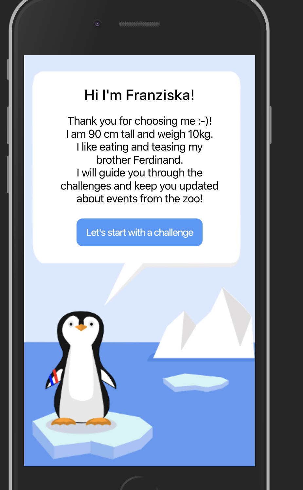
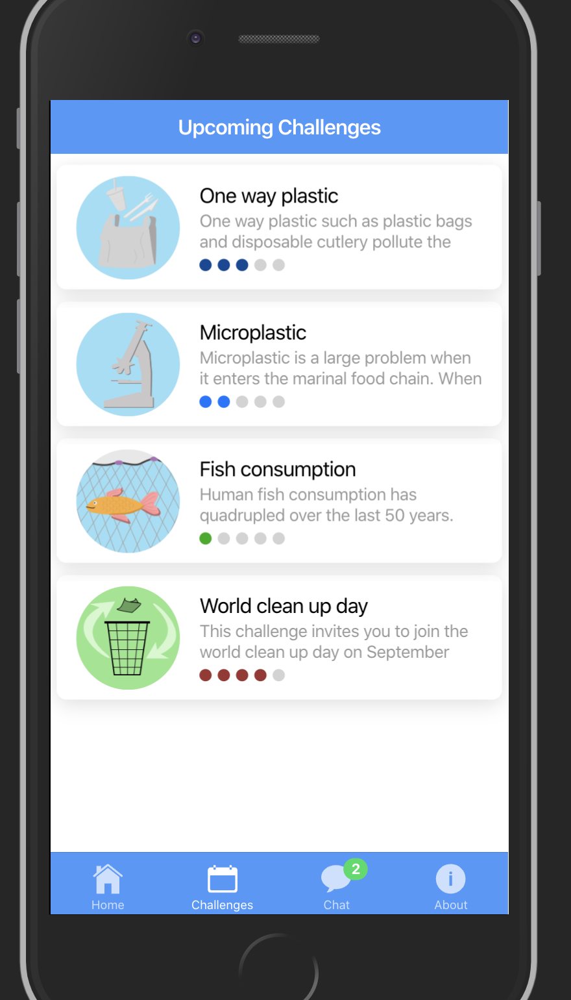
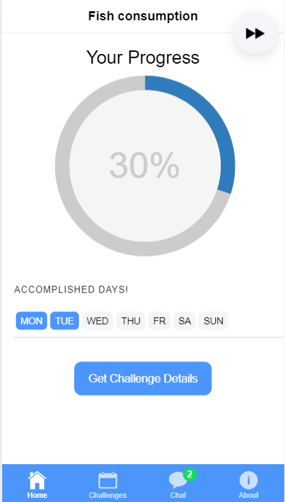

# Peyond

Welcome to our App **Peyond**! This App is intended to make people aware of the challenges that penguins face nowadays. The App wants to teach its users what influence their behavior has on the habitat of penguins.

In this App, you will find weekly challenges that may help to save the penguin's habitat. In addition, this App provides you a whole bunch of information and fun facts about penguins. So let's get started!

## How to run the app
1. Install Ionic using command: npm install -g ionic
2. run command: ionic serve

## Getting started

When you start the App for the first time, you see the welcome screen of the App. Swipe left for getting started. On the next screen, you can choose one of the penguins from the Zoo Zurich as your guide. This penguin will explain you the challenges and help you navigate through the App. 

Our idea behind this is that visitors of the Zoo Zurich can download the App while they're in the Zoo watching the penguins. This also allows them to select one of the penguin characters from the App and try to spot this specific penguin in the Zoo with the help of the collars that the penguins are wearing. This could create some kind of a bond between the user and the penguin. For this prototype, only the penguin "Franziska" is working so please choose this one.

## Getting to know your guide

Once you've chosen one of the penguins and spotted it in the Zoo, the penguin presents itself to the user and gives some facts about himself. 

Once you're done reading the introduction from your guide, click on "Let's start with a challenge".

## The challenges
On the next screen, you see a list of challenges that could help to save the habitat of penguins or learning more about penguins in general. YOu can read a short intro about the challenge and the dots on the bottom show you, how hard a challenge is from 1 = easy to five = hard. All challenges (except the "Learning more about penguins " challenge) last one week. The following challenges are available:

* One way plastic: Try to avoid single-use plastic for one week. This is important for penguins as single-use plastic could end up in the sea and penguins could get stuck in it and choke to death.
* Microplastic: Be more aware about microplastic in your daily life. This challenge wants you to take a closer look at the products that you are using daily and challenges you to avoid these products for one week. When microplastic ends up in the sea, the food of penguins (fish etc.) could get contaminated with it. When penguin later eat those fish, the microplastic gets into the bodies of penguins and can harm them.
* Fish consumption: Penguins eat mostly fish and are therefore dependent on large fish resources in the sea. When humans overfish the sea, penguins don't have enough food anymore. In addition, penguins could get stuck in the fish nets and die.
* World clean up day: This is a more general challenge that tries to make the world a cleaner place. It's an event that takes place worldwide and on this special day, people all around the world clean up the environment. This again could lead to less plastic polluting the oceans.
* Learning more about penguins: In this challenge, you learn more about some existing penguin species. You get some interesting facts about penguins and learn more about their lives. 

On the bottom, there's a buttom called "Challenges" that always brings you back to this screen. For this prototype, only the challenge "Fish consumption" and "Learning more about the penguins" are working so please pick one of those.  

## Fish consumption
Once you've chosen the challenge "Fish consumption", you get to the next screen the "Challenge Screen". On this view, your progress in the challenge is shown. As the challenges are weekly challenges, the goal is to note down everyday if you fulfilled the challenge criteria or not. You can click on the weekday buttons and check how the progress goes up. When the week is over, the App checks whether you met the challenge criteria often enough or not and gives you some feedback. 

For this prototype, you can just click on some of the weekday buttons. As we cannot wait till one week is over, we've implemented a fast forward buttton that simulated that one week is over and brings you to the end of the challenge. The button is located on the top right.

## Learning more about the penguins
Ths challenge is just for informational purpose and gives you more data to different penguin species. You can see a screen with five different penguin species and click on one of them for learning more about them. All of them are implemented so you can just click on one penguin icon and it will direct you to the details page.

## Penguin details page
On this page, you get more information about the chosen penguin species and see a real picture of the penguins. Once you are done reading, click on "Next" and you get again to the end of the challenge screen.

## Challenge End
When you've met the criteria of the challenge often enough, you succeeded in the challenge and are directed to the "Challenge End" screen where a happy penguin thanks you for your help. If you failed the challenge, this screen would show a sad penguin and ask you to try the challenge again. For this prototype, only the successful screen is implemeted. This is currently the end of the challenge worklflow. If you would use the App in real life, you would get back to the challenge screen and could choose the next challenge to work on.

## Additional functions
If we would have more time, we would have implemented a chat function where the user could interact with the penguin and get notifications from it. This could serve the Zoo as a channel for informing users about upcoming events that take place in the Zoo (for example the Penguin Parade in winter). Or a user could get updates on his chosen guide penguin and how he's doing in the Zoo. This chat function is only simulated and it shows how it could possibly look like if we would have had the time to implement it. For getting to the chat screen, click the chat button on the bottom.

We hope that our App helps to raise awareness about the lives of penguins and the challenges that they face everyday. Let's save the penguins!
